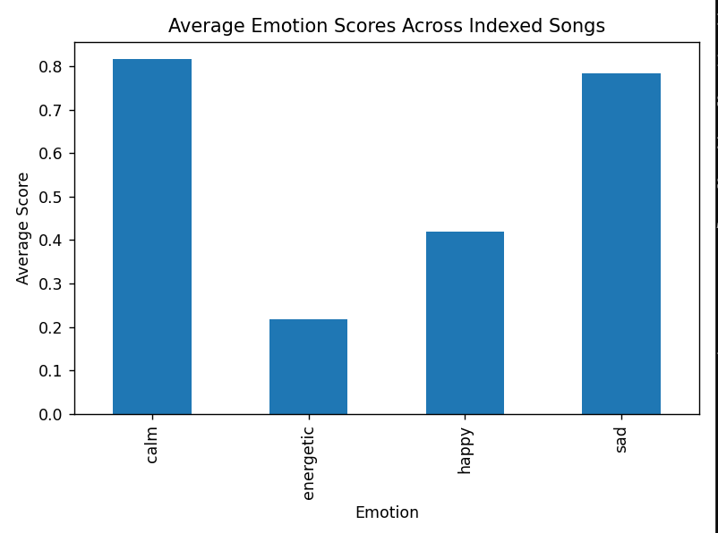
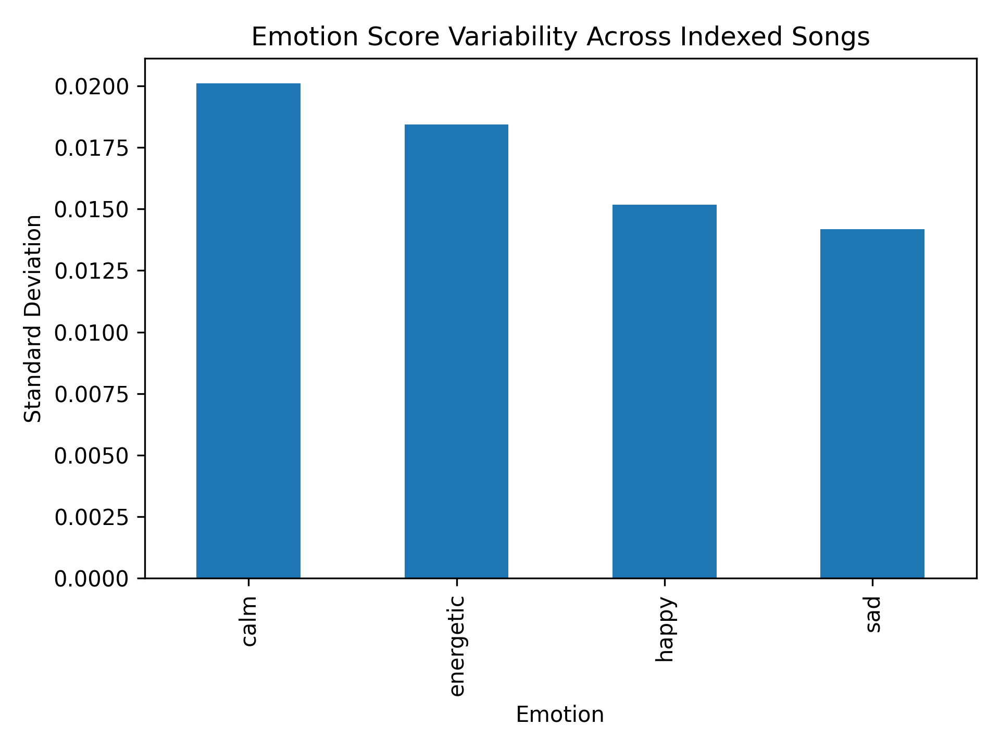

# 🎵 Auralis  
**Frequency- and Emotion-Aware Music Analysis & Hybrid Recommendation Framework**

Emotion Modeling | Acoustic Feature Engineering | Applied Machine Learning | Human-Centered AI

---

## 🌍 Project Overview

Auralis is a frequency- and emotion-aware music analysis and recommendation framework designed to bridge acoustic signal processing with interpretable artificial intelligence.

Unlike traditional recommender systems that primarily rely on user behavior tracking and collaborative filtering, Auralis focuses on intrinsic audio structure. The system analyzes spectral and timbral characteristics of music through Mel-Frequency Cepstral Coefficients (MFCCs), maps those acoustic representations to interpretable emotional dimensions, and performs similarity-based retrieval within feature space.

The long-term vision of Auralis is a hybrid system that combines:

- Frequency-driven emotion modeling  
- User preference pattern learning  
- Emotion-aligned recommendation logic  
- Conversational interaction through NLP and LLM integration  

The current version represents the foundational research and architectural layer of that broader vision.

This repository corresponds to:  
**Release v1.0-cadscom-draft**

---

## 🏗 System Architecture

Auralis follows a modular four-layer architecture designed for extensibility and interpretability.

### 1️⃣ Acoustic Feature Extraction

Audio signals are transformed into structured numerical representations using:

- 13 MFCC coefficients per time frame  
- Temporal aggregation via mean and standard deviation  
- 26-dimensional fixed-length feature vectors (13 means + 13 standard deviations)

This ensures consistent comparison across tracks of varying duration while preserving spectral characteristics related to timbre and energy distribution.

---

### 2️⃣ Emotion Modeling Layer

Emotion representation is aligned conceptually with the valence-arousal framework.  
Rather than using supervised classification in its current stage, Auralis applies an interpretable rule-based mapping from aggregated MFCC statistics to four emotional indicators:

- Calm  
- Energetic  
- Happy  
- Sad  

These scores reflect acoustic alignment within low/high arousal and valence regions. The model prioritizes transparency over black-box prediction at this stage of development.

---

### 3️⃣ Similarity & Retrieval Engine

Similarity between tracks is computed using cosine similarity within MFCC feature space:

- Angular alignment of feature vectors  
- Magnitude-independent comparison  
- Ranking based on acoustic proximity  

This allows emotionally aligned retrieval without dependence on behavioral data or user tracking.

---

### 4️⃣ Indexing & Data Layer

Auralis includes a structured indexing pipeline that processes collections of audio files and stores:

- File path  
- Predicted dominant emotion  
- Calm, energetic, happy, sad scores  
- 26-dimensional MFCC feature representation  

Indexed datasets are stored in CSV format to support scalable expansion and future benchmarking.

To rebuild the index locally:

```bash
python -m tools.build_index
```

---

## 📊 Exploratory Statistical Analysis

A preliminary dataset of 12 indexed audio tracks was analyzed to evaluate distributional behavior of the emotion mapping framework.

### Figure 1 – Average Emotion Scores Across Indexed Songs



Calm exhibited the highest mean emotional intensity within the current dataset, while energetic remained comparatively lower. These results reflect exploratory dataset composition and demonstrate measurable differentiation across emotional dimensions.

---

### Figure 2 – Emotion Score Variability Across Indexed Songs



Standard deviation analysis confirms non-uniform emotional distribution across indexed tracks, supporting computational coherence of the MFCC-based feature extraction and rule-based emotion mapping pipeline.

These findings are exploratory and are not presented as formal validation metrics. Expanded indexing and supervised benchmarking are planned for future development phases.

---

## 🖥 Interactive Prototype

A Streamlit-based interface demonstrates end-to-end functionality from raw audio ingestion to interpretable output.

The application allows users to:

- Upload one or two audio files  
- View predicted emotion score distributions  
- Inspect extracted feature metadata  
- Compute cosine similarity between tracks  

Run locally:

```bash
streamlit run app.py
```

---

## 🧠 Research Orientation

Auralis is structured as both:

1. A publishable research framework grounded in acoustic feature modeling and interpretable emotion mapping  
2. A scalable application foundation for future hybrid recommendation and conversational AI integration  

The system is intentionally modular to allow:

- Supervised emotion classification benchmarking  
- Larger-scale dataset indexing (50+ tracks and beyond)  
- User preference modeling  
- Emotion-based playlist generation  
- NLP and LLM-driven interaction layers  
- Integration with scalable vector search backends  

---

## 🧰 Project Structure

```text
Auralis/
├─ app.py
├─ requirements.txt
├─ src/
│  └─ auralis/
│     ├─ audio/
│     │  ├─ mfcc.py
│     │  ├─ features.py
│     │  └─ similarity.py
│     └─ emotion/
│        └─ emotion.py
├─ tools/
│  └─ build_index.py
├─ data/
│  ├─ raw/
│  │  ├─ samples/
│  │  └─ songs/
│  └─ processed/
│     └─ research_index.csv
└─ figures/
   ├─ Figure1_AvgEmotion_Across_Index.png
   └─ Figure_2_Emotion_Variability.png
```

---

## 🚀 Long-Term Vision

The ultimate goal of Auralis is an interactive, emotionally intelligent music recommendation system capable of:

- Understanding acoustic-emotional structure  
- Learning individual user preference patterns  
- Recommending songs aligned with desired emotional states  
- Generating emotion-consistent playlists  
- Communicating through natural language interfaces  

This repository represents the foundational stage of that larger capstone and research trajectory.

---

## 📦 Version Reference

Current documented state:  
**Release v1.0-cadscom-draft**

Includes:

- Research indexing pipeline  
- Statistical visualization outputs  
- Streamlit prototype  
- Modular acoustic feature architecture  

---

## 👤 Author

**Samuel Nono**  
M.S. Data Science  

Applied AI | Emotion Modeling | Intelligent Systems | Human-Centered Machine Learning
