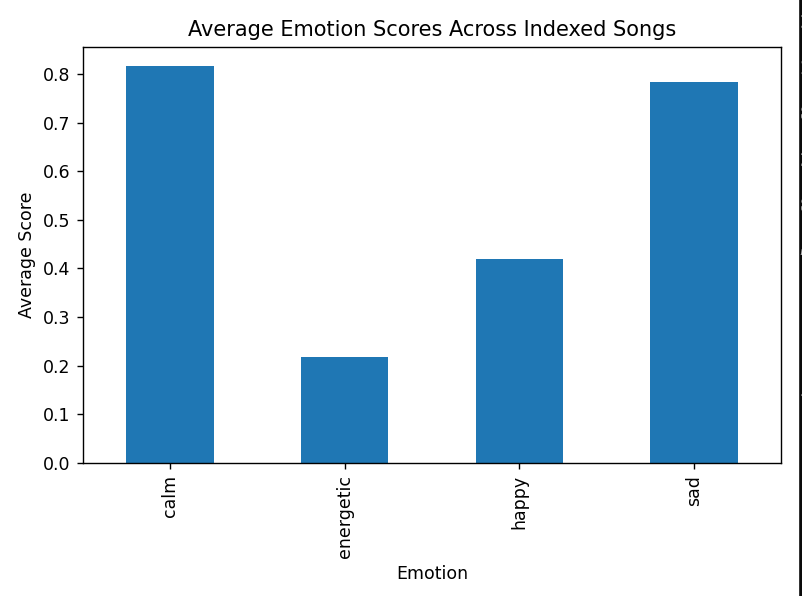
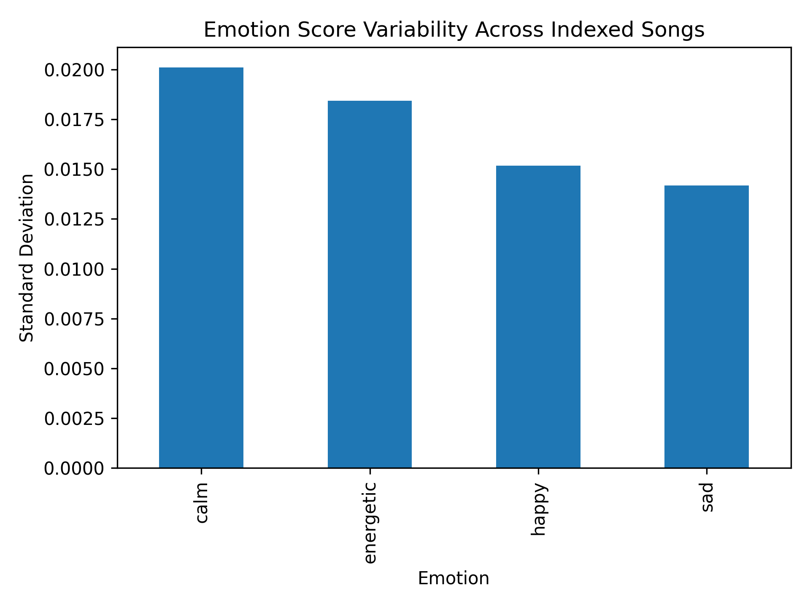

#  Auralis

**Frequency- and Emotion-Aware Music Analysis & Hybrid Recommendation System**

Emotion Modeling | Acoustic Feature Engineering | Machine Learning | Human-Centered AI

---

##  Overview

Auralis is a full-stack, emotion-aware music analysis and recommendation system that bridges **acoustic signal processing** with **interpretable artificial intelligence**.

Unlike traditional recommender systems that rely on user behavior, Auralis analyzes the **intrinsic structure of audio** to understand how music *feels* and uses that to drive recommendations and interaction.

This project was developed as a research-driven system (CADSCOM submission) and is being extended into a full production-ready capstone.

---

##  Live System Capabilities

The current system supports:

*  Audio upload and MFCC-based feature extraction
*  Interpretable emotion scoring (calm, energetic, happy, sad)
*  Similarity-based recommendation engine
*  Conversational chat interface (LLM + fallback reasoning)
*  Emotion-aware user profiling
*  Visualization of acoustic and emotional features

---

##  Full-Stack Architecture

* **Frontend:** React (Vite)
* **Backend:** FastAPI (Python)
* **ML Layer:** MFCC feature extraction + rule-based emotion modeling
* **Chat System:** LLM integration with fallback reasoning engine
* **Infrastructure:** Docker containerization for reproducibility

---

##  How It Works (End-to-End)

1. User uploads a song or interacts via chat
2. Backend extracts MFCC-based acoustic features
3. Features are mapped to interpretable emotional scores
4. System computes similarity using cosine distance
5. Recommendations are retrieved from indexed tracks
6. Chat system explains results or explores user preferences
7. Frontend visualizes outputs and enables interaction

---

##  Run with Docker (Recommended)

Launch the full system with one command:

```bash
docker compose up --build
```

Then access:

* Frontend → http://localhost:5173
* Backend API → http://localhost:8000/docs

This provides a fully reproducible environment across machines.

---

##  Core System Design

### Acoustic Feature Extraction

* 13 MFCC coefficients per frame
* Aggregated via mean and standard deviation
* Produces 26-dimensional feature vectors

This allows consistent comparison across tracks of varying length.

---

###  Emotion Modeling

Auralis uses an interpretable mapping aligned with the **valence-arousal framework**:

* Calm
* Energetic
* Happy
* Sad

Rather than black-box prediction, the system prioritizes **transparency and interpretability**.

---

###  Similarity & Retrieval

* Cosine similarity in MFCC feature space
* Magnitude-independent comparison
* Ranking based on acoustic proximity

This enables recommendations without relying on behavioral tracking.

---

### Indexing & Data Layer

Each indexed track includes:

* File path
* Dominant emotion
* Emotion score distribution
* MFCC feature vector

To rebuild the index:

```bash
python -m tools.build_index
```

---

##  Exploratory Analysis

### Average Emotion Distribution



### Emotion Variability Across Tracks



Initial analysis shows measurable variation across emotional dimensions, supporting the coherence of the MFCC-based pipeline.

---

##  Interactive Prototype

A Streamlit interface is included for experimentation:

```bash
streamlit run app.py
```

Allows:

* Uploading audio files
* Inspecting emotion scores
* Comparing similarity between tracks

---

##  Research Orientation

Auralis is both:

1. A research framework grounded in acoustic emotion modeling
2. A scalable application for real-world recommendation systems

Designed for extensibility into:

* Supervised emotion classification
* Larger-scale dataset indexing
* User preference learning
* Emotion-driven playlist generation
* Advanced conversational AI integration

---

##  Why Auralis Matters

Most recommendation systems optimize for engagement.

Auralis focuses on **understanding the music itself**.

By bridging signal processing with emotional interpretation, it enables systems that:

* Recommend based on how music *feels*
* Provide transparent reasoning
* Align AI decisions with human perception

This positions Auralis at the intersection of **machine learning, psychology, and human-centered AI**.

---

##  Project Structure

```text
Auralis/
├─ backend/
├─ frontend/
├─ data/
├─ figures/
├─ tools/
├─ app.py
├─ requirements.txt
├─ requirements-docker.txt
├─ docker-compose.yml
└─ README.md
```

---

##  Version

**v1.0 – CADSCOM Draft + Full-Stack Implementation**

- Continuous valence-arousal coordinates for every track
- Four-quadrant + eight-tag nuanced mood vocabulary
- Mood circumplex visualization in the Analyze UI
- LLM chat system-prompt extended with dimensional mood context
- Indexer rewritten to persist both discrete and continuous mood columns
- Backend `/analyze` and `/index` endpoints return the new mood object
- Backward-compatible: legacy index rows synthesise approximate mood
  coordinates from the discrete scores so no re-indexing is strictly required

* Research indexing pipeline
* Emotion modeling system
* Full-stack web interface
* Chat system with fallback
* Dockerized deployment

---

##  Author

**Samuel Nono**
M.S. Data Science
Minnesota State University, Mankato

---
