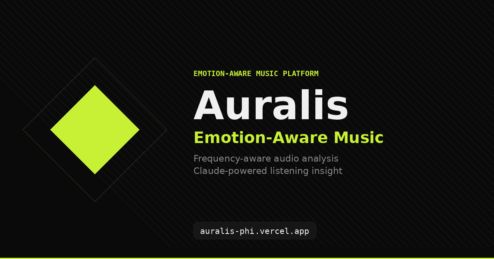
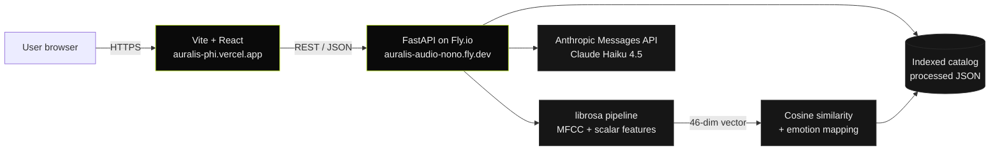

<div align="center">



# Auralis

**Frequency- and emotion-aware music analysis with a Claude-powered conversational layer.**

[**Live demo →** auralis-phi.vercel.app](https://auralis-phi.vercel.app) &nbsp;·&nbsp;
[**API →** auralis-audio-nono.fly.dev](https://auralis-audio-nono.fly.dev/health) &nbsp;·&nbsp;
[Author](#author)

[](https://auralis-phi.vercel.app)
[](https://auralis-audio-nono.fly.dev/health)
[](https://fly.io)
[](https://www.anthropic.com)
[](https://www.python.org)

</div>

---

## What it is

Most music recommendation systems optimize for engagement. They watch what you click and serve you more of the same. Auralis takes a different approach: it analyzes the **acoustic structure** of audio — the frequencies, the energy contour, the spectral shape — to understand how a track *feels*, then uses that understanding to recommend, compare, and explain music in plain language.

Upload a track and Auralis extracts a 46-dimensional acoustic signature, maps it onto a four-mood emotional taxonomy *and* a continuous valence–arousal plane, and ranks similar tracks from its catalog. A Claude-powered chat layer reads your evolving listening profile and answers questions about your taste in real time.

It's a research-grade audio pipeline wrapped in a production deployment, designed to be both interpretable and demonstrable.

---

## Live capabilities (today)

The system below is fully deployed and working at [auralis-phi.vercel.app](https://auralis-phi.vercel.app).

| Capability | What it does |
|---|---|
| **Analyze** | Upload a `.wav` or `.mp3`, extract 20 MFCC coefficients (mean + std), tempo, RMS energy, and spectral centroid statistics. Output: 46-dim feature vector + categorical mood + valence–arousal coordinates. |
| **Compare** | Drop two tracks side-by-side; get a cosine similarity score (0–1) over the same feature space. Verified end-to-end at 0.954 between two musically similar tracks. |
| **For You** | Ranked recommendations from the indexed catalog, scored against the user's evolving emotion profile. |
| **Chat** | Conversational layer powered by Claude Haiku 4.5. Receives the user's profile JSON as system context and answers questions about their listening taste with reference to actual numeric affinities. Per-IP rate-limited (10 req/hr). |
| **Profile** | Live emotion affinities (energetic, calm, happy, sad), valence–arousal centroid, like/dislike counts. Built incrementally from user interactions. |
| **Mood circumplex** | 2D visualization placing each analyzed track on a continuous valence–arousal plane with eight nuanced mood tags (excited, tense, melancholic, serene, etc.) layered on top of the four discrete categories. |

---

## Architecture


```mermaid
flowchart LR
    User[User browser] -->|HTTPS| Vercel[Vite + React<br/>auralis-phi.vercel.app]
    Vercel -->|REST / JSON| Fly[FastAPI on Fly.io<br/>auralis-audio-nono.fly.dev]

    Fly --> Audio[librosa pipeline<br/>MFCC + scalar features]
    Fly --> Index[(Indexed catalog<br/>processed JSON)]
    Fly --> Anthropic[Anthropic Messages API<br/>Claude Haiku 4.5]

    Audio -->|46-dim vector| Sim[Cosine similarity<br/>+ emotion mapping]
    Sim --> Index

    style Vercel fill:#0a0a0a,stroke:#c8f135,color:#f0f0f0
    style Fly fill:#0a0a0a,stroke:#c8f135,color:#f0f0f0
    style Audio fill:#161616,stroke:#2a2a2a,color:#f0f0f0
    style Index fill:#161616,stroke:#2a2a2a,color:#f0f0f0
    style Anthropic fill:#161616,stroke:#2a2a2a,color:#f0f0f0
    style Sim fill:#161616,stroke:#2a2a2a,color:#f0f0f0
```

**Frontend** is a Vite-built React SPA on Vercel with client-side routing (React Router v7). The HTML head ships with industry-standard Open Graph + Twitter card metadata, a brand-aligned favicon, and a Vercel SPA rewrite so deep links survive a hard reload.

**Backend** is a single FastAPI service in a slim Python 3.11 container, deployed to Fly.io's `shared-cpu-1x` (1 GB RAM) with scale-to-zero. Audio decoding uses `ffmpeg` + `libsndfile` for `.mp3` and `.wav` support. The live `/analyze` endpoint trims uploads to **30 seconds at 22 kHz mono** before feature extraction — this keeps peak memory under 100 MB during `librosa.load`, which is critical on the small VM and was the fix for an early OOM that surfaced on extended-version uploads.

**Audio pipeline** uses `librosa` to extract MFCCs and acoustic descriptors, then assembles a normalized 46-dimensional feature vector (20 MFCC means + 20 MFCC stds + tempo + RMS mean/std + spectral centroid mean/std). Each scalar is scaled into roughly the same numeric range as the MFCC coefficients to prevent any single feature from dominating cosine similarity.

**Emotion mapping** projects the feature vector into both a discrete four-mood taxonomy (calm, energetic, happy, sad) and a continuous valence–arousal coordinate. The chat layer receives both representations as system-prompt context, so Claude can reason about the user's profile in either dimensional or categorical terms depending on the question.

---

## Tech stack and why

| Layer | Choice | Rationale |
|---|---|---|
| Audio analysis | `librosa` | Industry-standard MFCC + spectral features, no GPU required, runs in <1 GB RAM with the 30s trim. |
| Backend | FastAPI | Async-first, automatic OpenAPI docs at `/docs`, type-checked request/response models via Pydantic. |
| Backend hosting | Fly.io | Multi-region edge deploy, scale-to-zero billing, fast cold starts, one-file `fly.toml` config. |
| Frontend | Vite + React 19 | Fastest dev iteration, native ES modules, instant HMR. |
| Frontend hosting | Vercel | Zero-config Vite preset, auto-deploy on git push, edge-cached static assets. |
| Conversational layer | Claude Haiku 4.5 (Anthropic API) | Cheap, fast, strong reasoning over structured JSON profiles. Per-IP rate-limited at 10 req/hr to bound API spend. |
| Containerization | Docker (multi-stage Python 3.11-slim) | Ships the indexed catalog inside the image so no external storage is required. |

---

## Roadmap

The next development phase moves Auralis from a curated indexed catalog to a discovery surface backed by Spotify's full ~100M-track catalog, while introducing a **custom MCP server** that exposes Auralis's music intelligence as a reusable tool layer for any LLM client.

### In active development

**Spotify Web API integration.** Replaces the For You tab's catalog backend with Spotify's `/recommendations` endpoint, seeded by the user's Auralis emotion profile mapped onto Spotify's audio features (`target_valence`, `target_energy`, `target_danceability`, `target_tempo`). App-level Client Credentials authentication so visitors get recommendations with zero login friction.

**Shazam-style "Save to Spotify."** Per-track action button that triggers a one-time Spotify OAuth Authorization Code flow with PKCE; subsequent saves are instant. Tracks land in the user's Liked Songs by default with an optional playlist picker. Tokens stored client-side via PKCE — no backend credential storage burden, no privacy surface.

**Custom MCP server (`auralis-mcp`).** Standalone Python service exposing `search_tracks`, `get_audio_features`, `recommend_similar`, and `get_auralis_profile` as Model Context Protocol tools. Deployed as a second Fly.io app. The chat endpoint will call Anthropic's Messages API with `mcp_servers` configured, letting Claude orchestrate music tool calls during conversation — no manual agentic loop in the backend. Architecturally separates Auralis's music intelligence from any specific consumer, so the same MCP server could be plugged into Claude Desktop, Cursor, or any other MCP-compatible client.

**Inline track cards in chat.** When Claude recommends a specific track in conversation, the response renders with an embedded card containing album art, a 30-second preview, and a "+ Save to Spotify" button. Maintains the Shazam trust model (Claude suggests; user explicitly saves).

### Research direction (longer-term)

- Supervised emotion classifier trained on a labeled mood dataset, replacing the current rule-based mapping.
- Scaled indexing pipeline to ingest 10K+ tracks from open datasets (FMA, Jamendo) for offline benchmarking.
- Voice I/O layer — speak a query, hear an answer with track previews mixed in.
- A/B comparison harness for measuring recommendation quality across the rule-based and Spotify-feature-based pipelines.

---

## Repository structure

```
Auralis/
├─ backend/
│  ├─ Dockerfile               # python:3.11-slim + ffmpeg + libsndfile
│  └─ main.py                  # FastAPI app: /analyze, /similarity, /recommendations, /profile, /chat
├─ src/auralis/
│  └─ audio/
│     ├─ mfcc.py               # librosa MFCC + tempo + RMS + spectral centroid
│     └─ features.py           # 46-dim feature vector assembly + normalization
├─ frontend/                   # Vite + React 19 + React Router v7
│  ├─ src/pages/               # Analyze, ForYou, Playlist, Chat, Profile
│  ├─ public/                  # Branded favicon, OG card, manifest
│  ├─ vercel.json              # SPA rewrite for client-side routing
│  └─ index.html               # Industry-standard meta head
├─ data/
│  ├─ raw/                     # Source audio
│  └─ processed/               # Indexed catalog (track features, mood labels)
├─ tools/
│  └─ build_index.py           # Offline indexing pipeline
├─ figures/                    # Exploratory analysis plots
├─ fly.toml                    # Fly.io deployment config
├─ requirements.txt            # Local dev deps
├─ requirements-docker.txt     # Container deps (pinned)
└─ README.md
```

---

## Local development

The fastest way to run the full stack locally is with Docker Compose:

```bash
docker compose up --build
# Frontend → http://localhost:5173
# Backend  → http://localhost:8000/docs
```

Or run the two services natively. Backend:

```bash
python -m venv .venv && source .venv/bin/activate
pip install -r requirements.txt
uvicorn backend.main:app --reload --port 8000
```

Frontend:

```bash
cd frontend
npm install
npm run dev
```

To use the live conversational layer locally, set `ANTHROPIC_API_KEY` in your environment (or in a `.env` file at the repo root). Without it, the `/chat` endpoint serves a deterministic fallback response. To rebuild the indexed catalog from a folder of audio files, run:

```bash
python -m tools.build_index
```

---

## Deployment

The deployed system runs on Fly.io (backend) and Vercel (frontend), tied together via a `CORS_ORIGINS` secret on the backend that whitelists the Vercel origin.

**Backend (Fly.io):**

```bash
flyctl secrets set ANTHROPIC_API_KEY=sk-ant-...
flyctl secrets set CORS_ORIGINS=https://auralis-phi.vercel.app
flyctl deploy
```

The `fly.toml` ships with `min_machines_running = 0` for scale-to-zero billing, which is appropriate for a demo workload. Cold start adds ~3–5 seconds to the first request after idle.

**Frontend (Vercel):** automatic deploy on `git push` to `main`. Set Root Directory to `frontend` and `VITE_API_URL` to the Fly URL in the Vercel project's Environment Variables.

---

## Engineering notes

A few decisions worth flagging for anyone reading the code:

The `/analyze` endpoint trims live uploads to 30s mono at 22 kHz before passing to `librosa.load`. This is not a quality decision — it's a memory-bound one. `librosa.load` with `sr=None` reads the full file at native rate and can balloon to ~1.5 GB virtual memory on a 30 MB extended-version WAV, which OOM-kills the worker on Fly's shared-cpu-1x. The 30s/22kHz/mono trim caps peak memory under 100 MB while preserving the emotion signal (validated by visual mood comparison across full-length vs trimmed analyses of the same tracks).

The Dockerfile pins `--workers 1` on uvicorn for the same reason: a single worker has the full machine memory available for audio decode. Two workers competing for 1 GB causes the same OOM cascade.

The 46-dimensional feature vector normalizes scalar features (tempo, RMS, spectral centroid) into roughly the [0, 1] range before concatenation with the MFCC coefficients. Without this, raw tempo values (60–180 BPM) and spectral centroid values (1000–8000 Hz) would dominate cosine similarity and crowd out the actual MFCC information.

---

## Origin

Auralis began as a CADSCOM (Computational Audio and Data Science Conference on Music) submission exploring whether interpretable acoustic feature engineering could compete with black-box collaborative filtering on emotion-aware recommendation tasks. The current version extends that research foundation into a deployed, conversational, full-stack product.

---

## Author

**Samuel Nono**
M.S. Data Science · Minnesota State University, Mankato
[samuelnono44@gmail.com](mailto:samuelnono44@gmail.com)

---

<div align="center">

Built with FastAPI · librosa · React · Claude · Fly.io · Vercel

</div>
